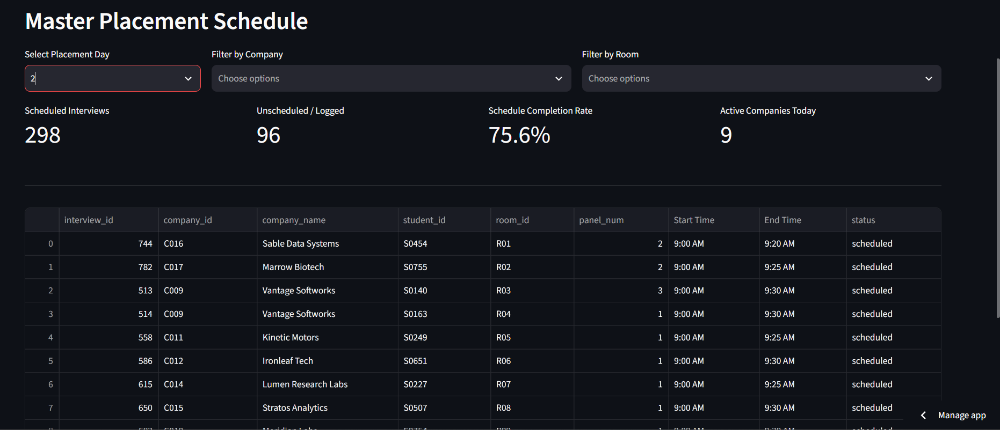
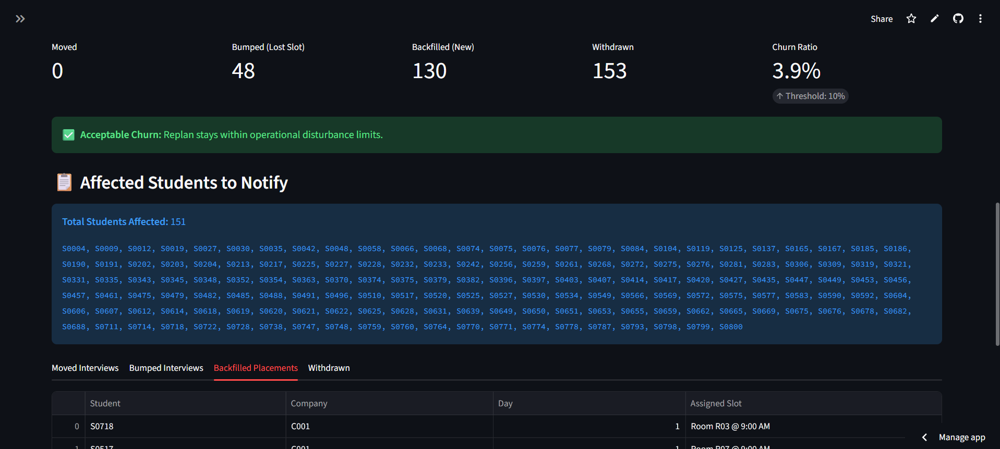
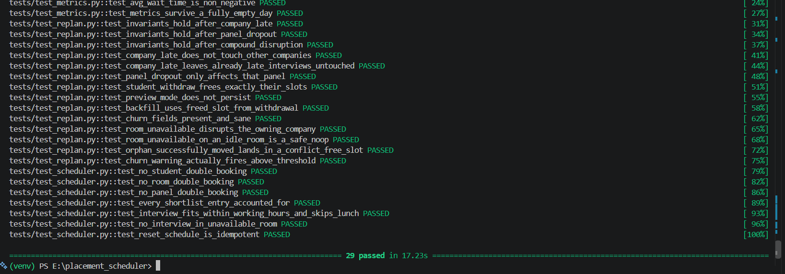

# Placement Week Scheduler

A scheduler + replan engine for a 4-day, 35-company,
800-student, 20-room placement week, with a coordinator dashboard.

**Live demo:** https://placement-scheduler-2gfgydahcdz9tql5qekbyl.streamlit.app/

## Architecture
- `data_gen/` — realistic dataset generator (companies/students/rooms/shortlists)
- `db/` — SQLite schema + the single data-access boundary (`store.py`) used
  by the scheduler, replan engine, and dashboard alike
- `scheduler/core.py` — initial greedy scheduler (round-robin room fairness
  + CGPA-priority slot filling)
- `scheduler/replan.py` — the replan engine: one shared repair primitive
  reused by all four disruption types, preview-then-commit via a real DB
  transaction
- `scheduler/metrics.py` — quality metrics (coverage, room utilization,
  student clashes, average wait time)
- `dashboard/app.py` — Streamlit coordinator UI
- `tests/` — 29 tests: hard-constraint invariants, minimal-disturbance
  behavior, and a defense-scenario regression guard
- `docs/writeup.md` — the three required design-decision answers

## Run locally
```bash
python3 -m venv venv
source venv/bin/activate        # Windows: venv\Scripts\Activate.ps1
pip install -r requirements-dev.txt
python3 data_gen/generate.py --seed 42
pytest tests/ -v
streamlit run dashboard/app.py
```

## System Screenshots

**1. Master Schedule View**


**2. Replan Engine: Minimal Disturbance Diff**


**3. Automated Test Suite**


## Defense Write-up
The answers to the three architectural defense questions (regarding schedule constraints, graceful degradation, and churn thresholds) can be found in [docs/writeup.md](docs/writeup.md).

## Known limitations
See `docs/writeup.md` and the list below for edge cases handled
deliberately vs. out of scope.